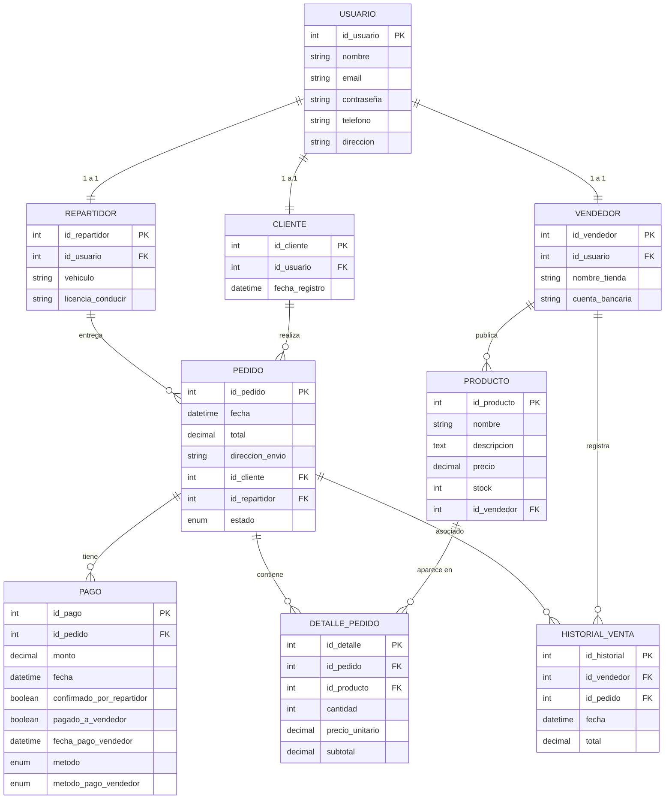

# Plataforma de Ferias y Emprendimientos Estudiantiles (IHC)

Este repositorio contiene una aplicación Next.js (app router) para una plataforma de ferias artesanales y emprendimientos estudiantiles. Está preparada como demo/local — la persistencia de usuarios y sesiones se realiza en `localStorage` para facilitar pruebas en desarrollo.

## Contenido principal

- `app/` — páginas de la aplicación (Next.js App Router).
- `components/` — componentes React reutilizables (UI, auth, comprador, vendedor, admin, shared, etc.).
- `hooks/` — hooks personalizados (`use-toast`, `use-mobile`, ...).
- `lib/` — utilidades del proyecto.
- `public/` — assets públicos.
- `styles/` — estilos globales.

## Requisitos

- Node.js (>= 18 recommended)
- npm (o pnpm/yarn si prefieres). Este proyecto fue probado con `npm`.

## Instalación (desarrollo)

Se recomienda usar la instalación de dependencias con la opción `--legacy-peer-deps` por la incompatibilidad de peer dependencies entre `vaul@0.9.9` y React 19 (el proyecto usa React 19 actualmente). Hay una nota más abajo con alternativas y recomendaciones a largo plazo.

Instalar dependencias (PowerShell):

```powershell
npm install --legacy-peer-deps
```

Arrancar en modo desarrollo:

```powershell
npm run dev
```

Build de producción:

```powershell
npm run build
npm start
```

Lint:

```powershell
npm run lint
```

## Qué incluye la aplicación (resumen funcional)

- Autenticación demo: los usuarios y sesiones se guardan en `localStorage` y hay utilidades en `components/auth/users.ts` para crear/validar usuarios, solicitar reset y gestionar la sesión.
- Dashboards separados para `vendedor` y `comprador`.
- Componentes UI reutilizables en `components/ui/` (botones, formularios, drawer, avatar, etc.).
- Perfil de usuario: páginas de edición de perfil ya implementadas en:
	- `app/vendedor/perfil/page.tsx`
	- `app/comprador/perfil/page.tsx`

	Estas páginas usan el componente reutilizable `components/shared/profile-form.tsx` que valida con `zod` + `react-hook-form`, actualiza el usuario en `localStorage` y actualiza la sesión visible en el header.

## Cómo probar la edición de perfil

1. Ejecuta la app en desarrollo (`npm run dev`).
2. Inicia sesión con un usuario existente (o crea uno con el registro). Hay un admin por defecto creado por `ensureAdminExists()` (email: `admin@gmail.com`, password: `admin`).
3. Accede a `/vendedor/perfil` o `/comprador/perfil` según tu rol.
4. Edita `Nombre`, `Email`, `Teléfono` o cambia la contraseña (opcional). Haz clic en `Guardar`.
5. Verifica que:
	 - Aparece un toast de éxito.
	 - El header muestra el nombre actualizado.
	 - Tras recargar la página, los cambios persisten.

Nota: por ahora la persistencia se hace en `localStorage` — es suficiente para demo y pruebas locales. Para producción, implementa rutas API y almacenamiento en servidor.

## Cambios recientes y decisiones importantes

- Se añadió un formulario `ProfileForm` reutilizable en `components/shared/profile-form.tsx`.
- Se añadieron las rutas `/vendedor/perfil` y `/comprador/perfil`.
- Se añadió un enlace/avatar en el header (`components/shared/app-header.tsx`) que enlaza al perfil según el rol y es responsive.

## Nota sobre peer-dependencies (vaul + React)

Al instalar dependencias se detectó un conflicto: `vaul@0.9.9` declara peer dependency para React `^16.8 || ^17 || ^18` y el proyecto usa `react@19.2.0`. npm 9+ falla por defecto en estos casos.

Opciones para resolverlo:

1. Solución rápida (usada en este repositorio): instalar con `--legacy-peer-deps`.
	 - Pros: instalación inmediata y desarrollo rápido.
	 - Contras: oculta incompatibilidades; `vaul` podría no funcionar correctamente con React 19.

2. Solución conservadora: degradar `react` y `react-dom` a la serie 18.x y actualizar `@types/react` a `^18`.

3. Solución a largo plazo: reemplazar `vaul` por otro componente/implementación de drawer compatible o actualizar `vaul` si existe una versión que soporte React 19.

Recomendación: Para desarrollo rápido puedes mantener `--legacy-peer-deps`, pero antes de pasar a producción o CI, escoge una de las opciones 2 o 3 y valida la compatibilidad.

## Cómo contribuir

- Clona el repositorio, crea una rama por feature/fix y abre un PR.
- Mantén la coherencia de estilos y ejecuta `npm run lint` antes de abrir el PR.

## Testing recomendado (próximos pasos)

- Añadir tests e2e con Playwright o Cypress para cubrir:
	- Edición de perfil (tiempo medio y tasa de éxito).
	- Flujos de login/registro/reset.
- Añadir tests unitarios para validaciones y utilidades en `components/auth/users.ts`.

## Contacto y notas finales

Si necesitas que implemente persistencia en servidor (API routes + DB), pruebas e2e automatizadas o que resuelva el conflicto de `vaul`/React, dime qué opción prefieres y lo implemento.

---
Archivo: `README.md` (actualizado)

## Tecnologías

Lista de las principales tecnologías y librerías usadas en el proyecto:

- Next.js (App Router) — `next@16.0.0`
- React — `react@19.2.0`, `react-dom@19.2.0`
- TypeScript — `typescript@^5`
- Tailwind CSS — `tailwindcss@^4.1.9`
- Radix UI — varios paquetes `@radix-ui/react-*` para componentes accesibles
- Vaul — `vaul@^0.9.9` (drawer component; ver nota sobre peer-deps)
- react-hook-form + @hookform/resolvers — formularios y validación
- zod — `zod@3.x` para validación de esquemas
- sonner / custom toasts — sistema de notificaciones
- lucide-react — iconos

Nota: la lista completa de dependencias está en `package.json`.

## Qué hace cada perfil (features por role)

1. Vendedor
	 - Acceso a `/vendedor/dashboard`.
	 - Añadir/editar/listar productos (UI disponible: `components/vendedor/*`).
	 - Editar perfil en `/vendedor/perfil` (nombre, email, teléfono, contraseña).
	 - Atajos: `n` abre diálogo "Añadir producto" (si está en dashboard).

2. Comprador
	 - Acceso a `/comprador/dashboard`.
	 - Navegar catálogo y ver detalle de producto (`components/comprador/*`, `product-grid`, `product-detail-dialog`).
	 - Añadir al carrito y ver carrito (UI demo: `components/comprador/cart-sheet.tsx`).
	 - Editar perfil en `/comprador/perfil`.

3. Admin
	 - Acceso a `/admin/dashboard`.
	 - Gestión de usuarios y productos (UI: `components/admin/users-table.tsx`, `components/admin/products-table.tsx`).
	 - Funciones administrativas demo (no hay backend real por defecto).

## Funcionamiento general del sistema

- Autenticación y sesión:
	- No hay backend por defecto: el sistema guarda usuarios en `localStorage` (`marketplace_users_v1`) y la sesión en `marketplace_session_v1`.
	- `components/auth/users.ts` contiene utilidades: crear usuario (`addUser`), validar credenciales (`validateCredentials`), solicitar/resetear contraseña (`requestPasswordReset`, `resetPassword`), gestionar sesión (`setSession`, `getSession`).

- Flujo de registro/login:
	1. El usuario se registra (o el admin se crea automáticamente por `ensureAdminExists()`).
	2. Al iniciar sesión, la sesión se escribe en `localStorage` y el header muestra el nombre.
	3. El role del usuario determina rutas y acciones disponibles (vendedor/comprador/admin).

- Edición de perfil:
	- Las páginas `/vendedor/perfil` y `/comprador/perfil` usan `components/shared/profile-form.tsx`.
	- El formulario validará con `zod`, actualizará el usuario en `localStorage` mediante `updateUserProfile` y actualizará la sesión (`setSession`) para reflejar cambios inmediatos.

- Persistencia y límites actuales:
	- Todo el almacenamiento es local: `localStorage`.
	- Esto facilita pruebas pero no es seguro ni escalable. Para producción hay que implementar API routes y una base de datos.

## Modelo Entidad-Relación (ER)

Descripción textual del modelo de datos que la aplicación usa o debería usar cuando se implemente backend/DB.

Entidades principales:

- User
	- id (UUID o autoincrement)
	- name
	- email (único)
	- password (hashed en backend)
	- phone
	- role (enum: vendedor, comprador, admin)

- Product
	- id
	- title
	- description
	- price
	- images (array/relación a table de imágenes)
	- vendor_id (FK -> User.id)
	- created_at, updated_at

- Order (sugerido / futuro)
	- id
	- buyer_id (FK -> User.id)
	- total
	- status
	- created_at

- OrderItem (sugerido / futuro)
	- id
	- order_id (FK -> Order.id)
	- product_id (FK -> Product.id)
	- quantity
	- price_at_purchase

Relaciones clave:

- User (vendedor) 1 — * Product
- User (comprador) 1 — * Order
- Order 1 — * OrderItem
- Product 1 — * OrderItem (a través de OrderItem.product_id)

Diagrama ER (ASCII)

```
User {1} -----< {many} Product
	[id]              [id]
	[email]           [title]
	[name]            [vendor_id -> User.id]

User {1} -----< {many} Order
Order {1} -----> {many} OrderItem -----> {1} Product

```

Diagrama ER (Mermaid)



Nota: el diagrama Mermaid se puede renderizar en plataformas que soporten Mermaid; si no, la representación ASCII anterior contiene la misma información.

## Siguientes pasos sugeridos

- Implementar API routes y una base de datos (SQLite/Postgres) con migraciones.
- Añadir autenticación segura (JWT o cookies con sesiones server-side) y hashing de contraseñas.
- Añadir pruebas e2e (Playwright/Cypress) para métricas UX y flujos críticos.

Si quieres, puedo empezar por crear las API routes para usuarios y productos y una pequeña capa de persistencia con SQLite (Prisma) — dime si lo prefieres y lo preparo como siguiente PR.
